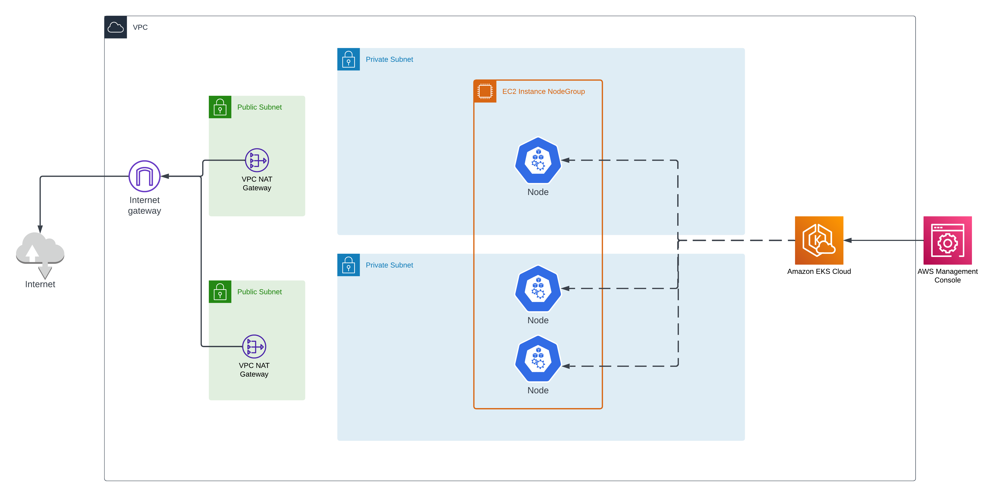

# Introduction

This repository contains an AWS CloudFormation template (eks-stack.yaml) for provisioning an Amazon EKS cluster. The template sets up the necessary resources, including roles, security groups, and the cluster itself and (eks-vpc-stack.yaml) for creating the VPC.

# Run it
- export AWS_PROFILE=user1 # The name of the profile you want to use
- ./create-vpc-stack.sh
- ./create-eks-stack.sh

# Clean up
- ./delete-eks-stack.sh
- ./delete-vpc-stack.sh

# Tips

## Update Kubeconfig
aws eks update-kubeconfig --region eu-central-1 --name my-eks-cluster

## Install an ingress controller
https://kubernetes.github.io/ingress-nginx/deploy/#quick-start

## Verify ingress controller
kubectl get service ingress-nginx-controller --namespace=ingress-nginx

# Architecture

# Template Details
The CloudFormation template (eks-stack.yaml) provisions the following resources:

## Roles
EksRole: IAM role for the Amazon EKS cluster. It allows EKS to assume this role and perform necessary actions.
EksNodeRole: IAM role for the worker nodes in the Amazon EKS cluster. It allows EC2 instances to assume this role and interact with the cluster.
## EKS Cluster
EksCluster: Amazon EKS cluster resource. It creates the EKS cluster with the specified name, Kubernetes version, and associated roles. The cluster is configured to use the specified security group and subnets.
## EKS Nodegroup
EksNodegroup: Amazon EKS node group resource. It creates the worker nodes for the EKS cluster using the specified configuration. The node group is associated with the cluster and uses the specified role and subnets.
## Customization
Feel free to customize the CloudFormation template to suit your specific requirements. You can modify the parameters, add additional resources, or adjust the configuration as needed.

## References
For more information about Amazon EKS and AWS CloudFormation, refer to the following documentation:

Amazon EKS Documentation
AWS CloudFormation Documentation